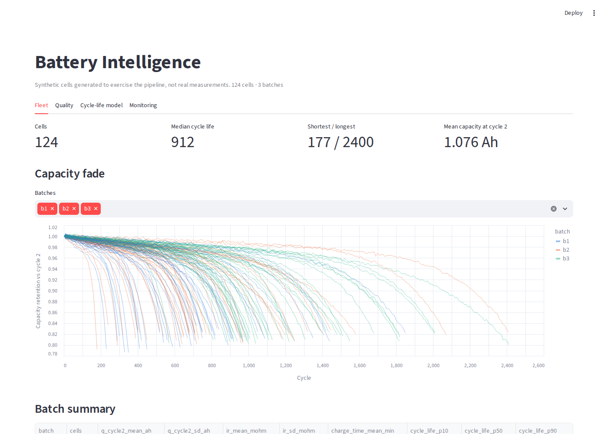
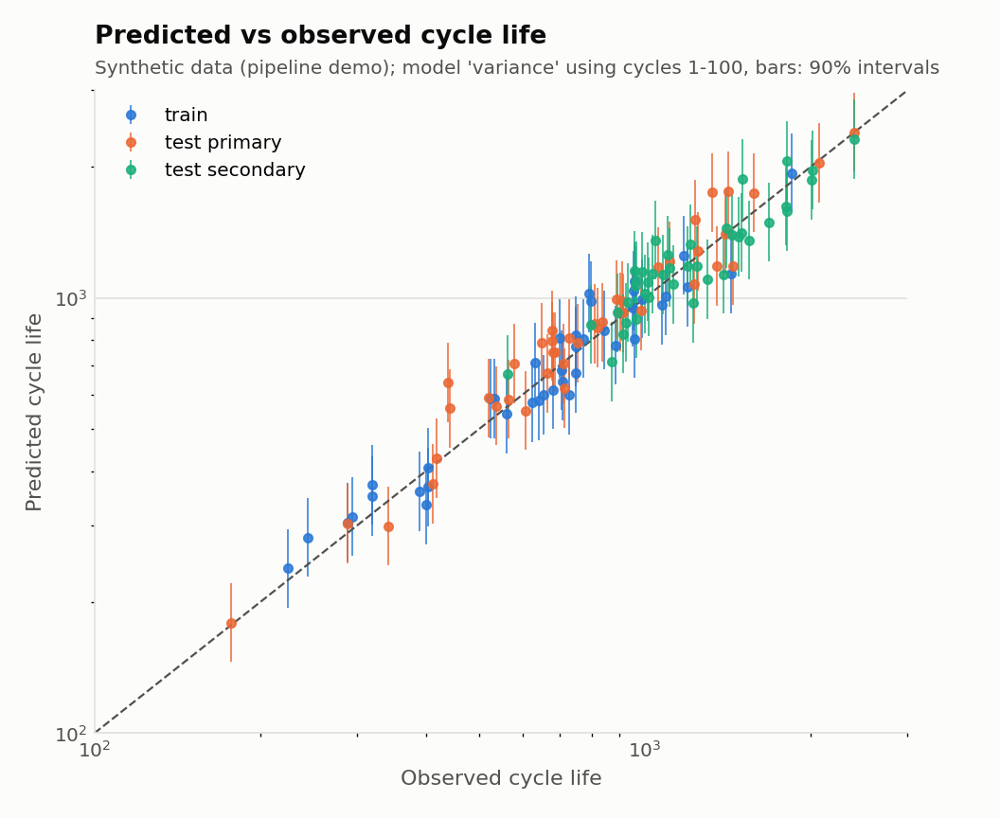
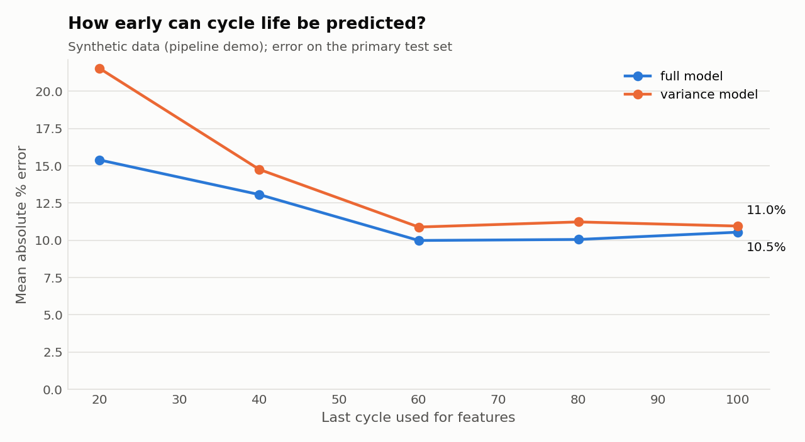
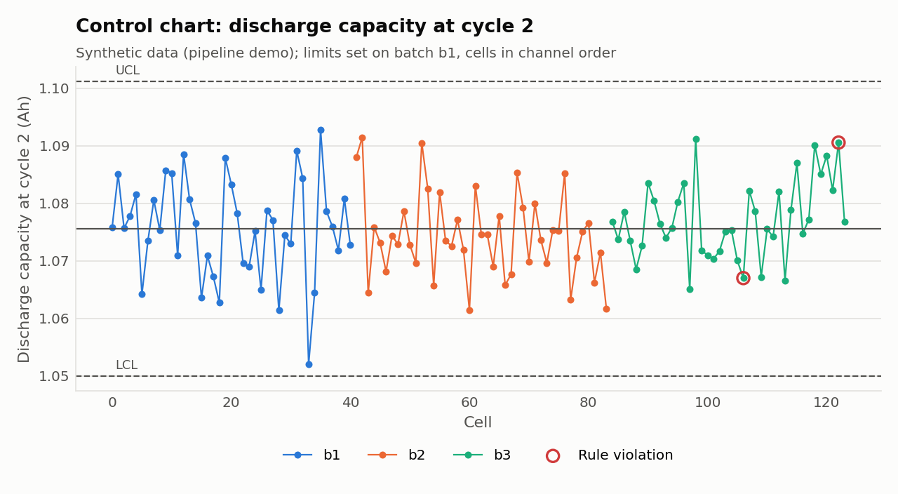
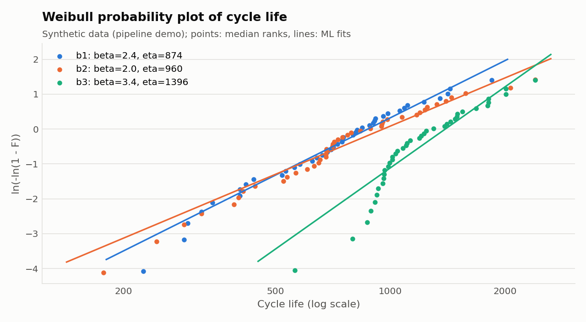
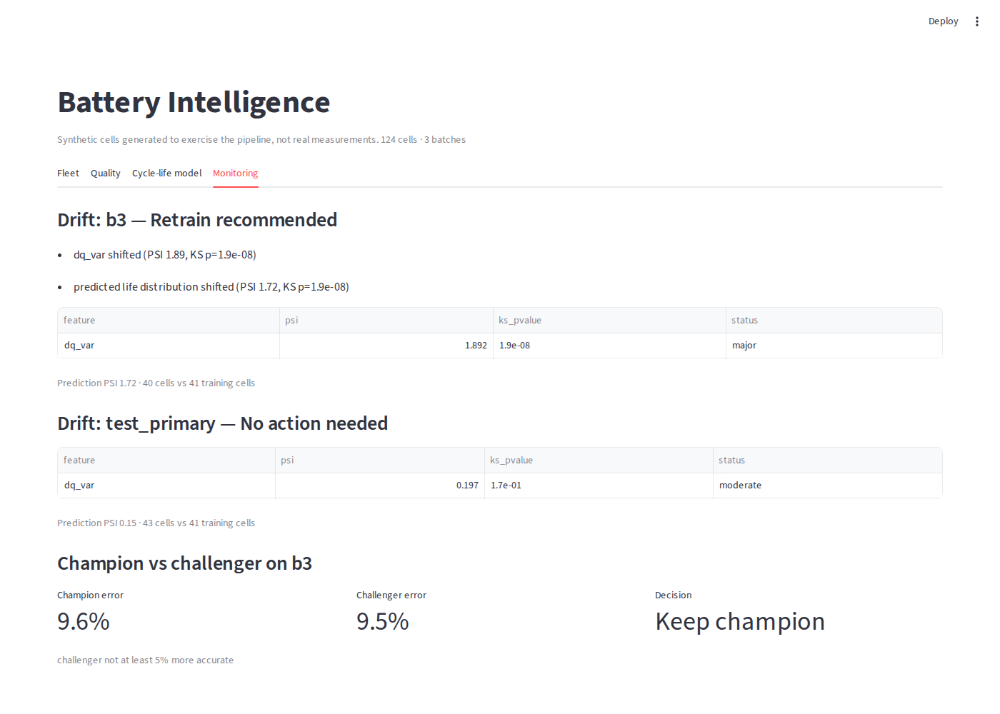

# Battery Intelligence Platform

An end-to-end analytics platform for lithium-ion cell testing. It takes raw
cycler data into a validated lakehouse and runs process-control and reliability
statistics on it. From the first 100 cycles, it predicts how many cycles a cell will last, with an
uncertainty interval. The model is served and monitored, with a streaming path
that makes the same predictions as cells come off test.

It is built around the public dataset from Severson et al., *"Data-driven
prediction of battery cycle life before capacity degradation"*
(Nature Energy, 2019): 124 commercial LFP/graphite cells, fast-charged under 72
different policies until they reached 80% of nominal capacity. Their life ranges from about
150 to 2,300 cycles.



> **About the numbers and images on this page.** They come from the
> **synthetic** generator (`bip ingest --source synthetic`). It produces cells in
> the same format as the real dataset so the whole platform, tests and CI run
> without the 3 GB download. Synthetic cells have known ground truth and are
> labelled as such on every chart. They are **not** results on real batteries.
> To run on the real data, see [Real data](#real-data).

## What it does

| Stage | Command | What happens |
|---|---|---|
| Ingest | `bip ingest` | Reads the MATLAB v7.3 batch files and applies the paper's cell cleaning. Writes Parquet: cells, per-cycle summaries, Q(V) discharge curves. Out-of-range records go to a quarantine table, not the bin. |
| Transform | `bip transform` | dbt + DuckDB over the Parquet files: staging models, a per-cell lifecycle mart, batch quality, capacity fade. 21 data tests. |
| Quality | `bip quality` | I-MR control charts with Western Electric rules, Cp/Cpk, PCA (T² / Q-residual) anomaly detection on discharge curves, Weibull reliability with censoring, B10 life with confidence intervals. |
| Model | `bip train` | Early-life features (ΔQ(V) between cycles 10 and 100, fade, resistance, charge time). Baselines, elastic nets and gradient boosting, selected by cross-validation only. Conformal 90% intervals, plus an early-window study and feature importance. |
| Registry | `bip register` | Logs the run to MLflow and registers the model. Production is the version with the `champion` alias. |
| Drift | `bip drift` | PSI + KS tests on features and predictions, plus error and coverage once labels arrive. Recommends retraining with reasons. |
| Retrain | `bip retrain` | Champion vs challenger on held-out cells from a new batch. Promotes only on a real improvement with calibrated intervals. |
| Serve | `bip serve` | FastAPI: predict from features or from raw early-cycle data, with input validation. |
| Stream | `bip stream` | Replays cycler data through Kafka (Redpanda). The consumer raises quality alerts at cycles 2 and 10 and publishes a life prediction at cycle 100. |
| Dashboard | `make dashboard` | Streamlit: fleet, quality, model and monitoring views. |

How the pieces fit together, and why each was built the way it was: [docs/ARCHITECTURE.md](docs/ARCHITECTURE.md).

## Quick start

```bash
pip install -e ".[dev,stream,dashboard]"
make demo        # whole pipeline on synthetic cells
make dashboard   # http://localhost:8501
make test        # 45 tests
```

With Docker, a local Kafka-compatible broker, an MLflow server and the API:

```bash
docker compose up -d
bip stream --role produce --bootstrap localhost:19092
bip stream --role consume --bootstrap localhost:19092
curl localhost:8000/health
```

## Real data

1. Download the three batch files from the
   [data.matr.io](https://data.matr.io/1/) (project: *Data-driven prediction of battery
   cycle life before capacity degradation*) into `data/raw/`:
   - `2017-05-12_batchdata_updated_struct_errorcorrect.mat`
   - `2017-06-30_batchdata_updated_struct_errorcorrect.mat`
   - `2018-04-12_batchdata_updated_struct_errorcorrect.mat`
2. `pip install -e ".[real-data]"` and run `make real`.

Every chart then shows "Severson et al. 2019 cells" in place of the synthetic label.
The split, cell cleaning and feature sets follow the paper, so results can be
compared directly with its Table 1.

## Results on synthetic cells

These numbers show the pipeline works end to end. They do not describe real cells.

**Lifetime model.** Cross-validation picked the one-feature variance model. On the
43-cell primary test set it has 11.0% mean absolute error, against 20.9% for a
capacity-only baseline and 40.3% for predicting the mean. Its 90% intervals
cover 88% of test cells. Gradient boosting fit the training set almost perfectly
(0.5% error) and did worse on test (12.6%). Selecting by cross-validation, not training fit,
is what kept it out.

<p>


</p>

**Quality.** Control limits are set on batch 1. Batch 3 shows two run-rule
violations on cycle-2 capacity, and every batch is capable (Cpk > 1.3).
The Weibull fits differ significantly by batch (likelihood-ratio p ≈ 2e-6).
B10 life is 338 cycles for batch 1 and 713 for batch 3.

<p>


</p>

**Monitoring.** Cells from the training population pass the drift check (no
retrain). Batch 3, which used gentler charging policies, is flagged: the ΔQ variance
feature has PSI 1.89 with KS p ≈ 2e-8. A challenger retrained with half of batch 3 was
0.7% more accurate on the other half. That is below the 5% bar, so the champion stayed.



## Design notes

- **No leakage from the future.** Features use cycles 1–100 only. A test changes
  everything after cycle 100 and checks that the features are unchanged.
- **Test labels never pick the model.** Selection uses training-set
  cross-validation only. A test scrambles the test labels and checks that the same model is picked.
- **One feature function.** Training, the API and the stream consumer all call
  `bip.ml.features.cell_features`. Tests check that API and stream predictions
  match the batch pipeline.
- **Small-sample statistics.** A battery program has tens of cells per batch. That is why drift
  needs both effect size and significance, why anomaly thresholds come from out-of-fold scores,
  and why Weibull B10 is reported with its interval.
- **Bad data is kept, not hidden.** Rejected records go to a quarantine table with a reason.

## Layout

```
bip/
  sources/     severson.py (real .mat files), synthetic.py
  lake.py      validation, quarantine, Parquet writer
  quality/     spc.py, anomaly.py, reliability.py, report.py
  ml/          features.py, models.py, train.py
  mlops/       registry.py, drift.py, retrain.py, serve.py
  stream/      broker.py, cycler.py, consumer.py
  cli.py
dbt/           staging + marts + data tests (DuckDB)
dashboard/     Streamlit app
tests/         45 tests: data platform, quality, model, MLOps, streaming
```

## Reference

K. A. Severson, P. M. Attia, N. Jin, et al. Data-driven prediction of battery
cycle life before capacity degradation. *Nature Energy* 4, 383–391 (2019).
